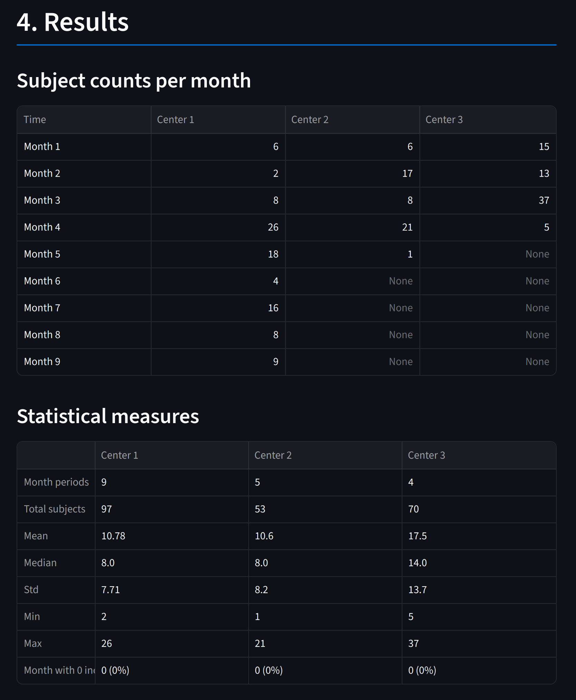
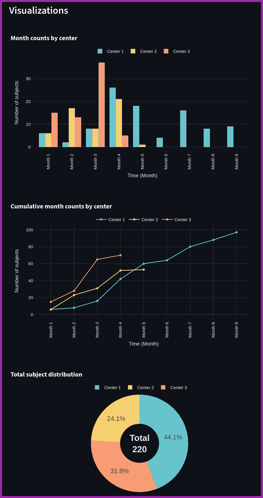
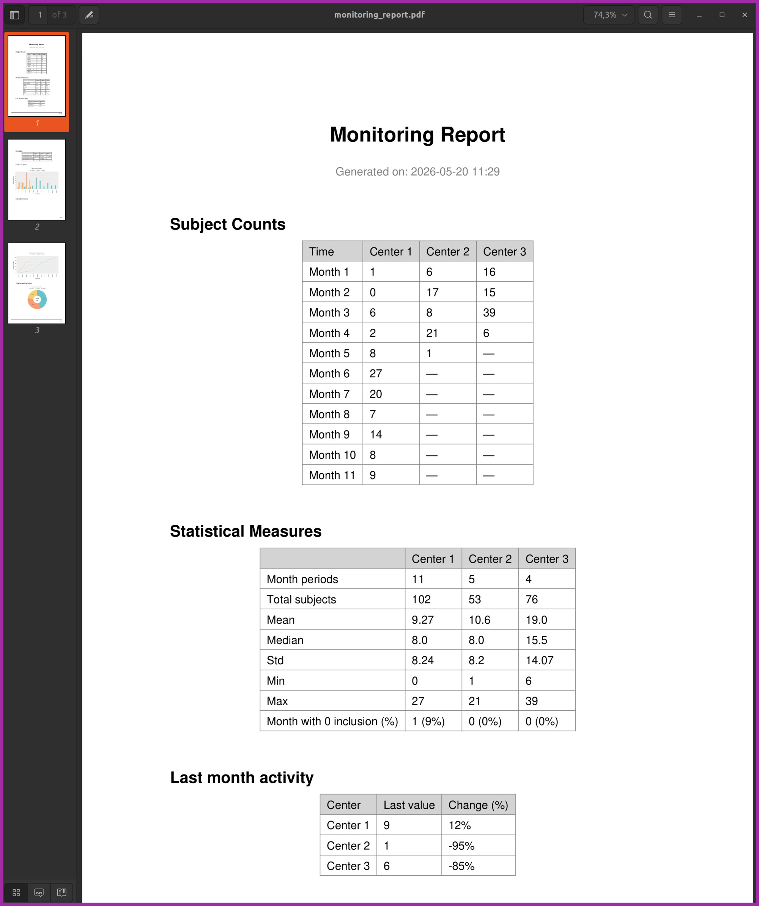
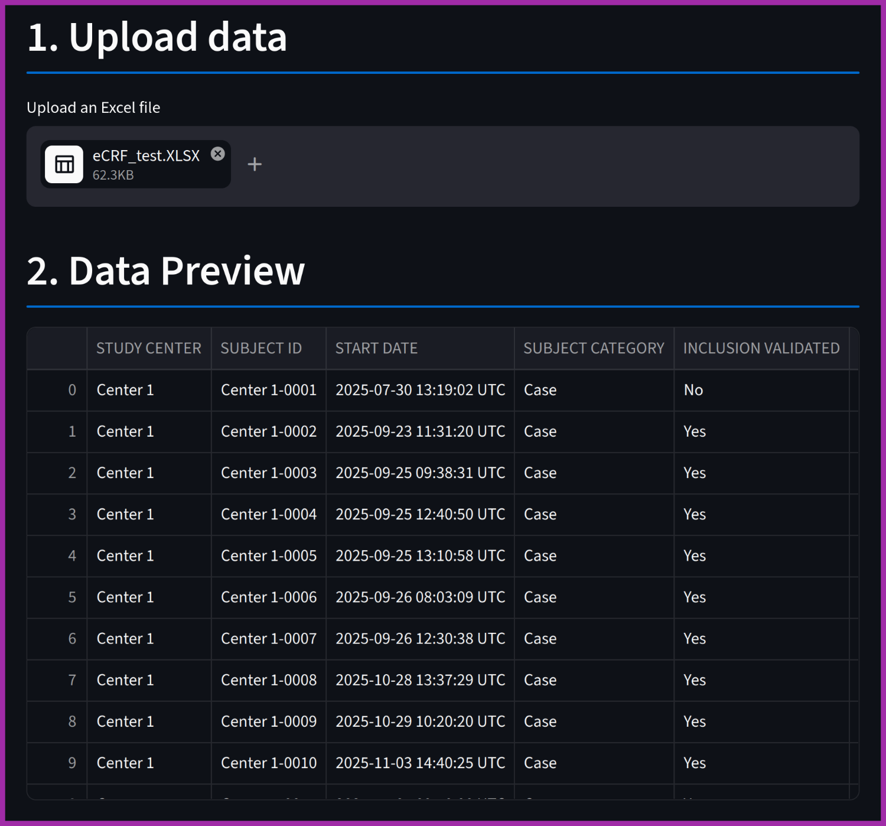
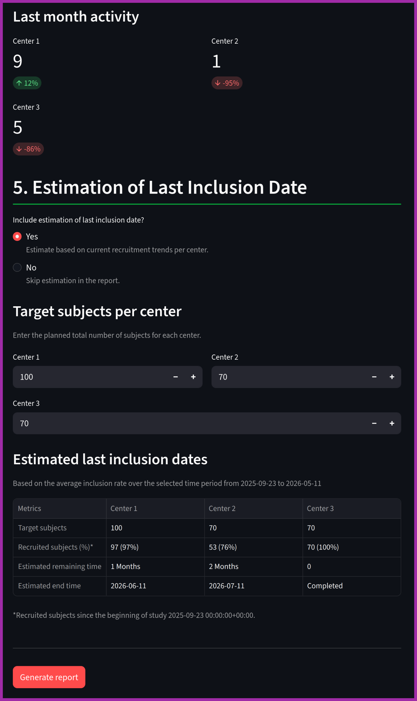

# Monitoring Dashboard

<a name="project-overview"></a>

## 📊 Project Overview

An interactive, data-driven dashboard designed for 
clinical operations and research teams to monitor multi-center 
study recruitment, track site performance, and forecast enrollment milestones.

This application empowers trial managers to optimize recruitment strategies through:
- **Real-Time Analytics:** Monitor dynamic enrollment velocity and baseline KPIs across the entire project.
- **Site Performance Benchmarking:** Compare center-level metrics to quickly identify high-performing sites and underperforming laggards.
- **Timeline Alignment:** Standardize recruitment trends across centers by aligning data by "time since first inclusion," bypassing differences in site opening dates.
- **Site Vitality Tracking:** Automatically detect inactive sites, flag potential closures, and validate operational timeline constraints.
- **Predictive Forecasting:** Estimate final trial completion and last-subject-in (LSI) dates using current operational momentum.
- **Executive Reporting:** Generate and download comprehensive, publication-ready PDF monitoring reports packed with automated charts and metrics.

---

## 📑 Table of Contents

- [Project Overview](#project-overview)
- [Core Features](#features)
- [Dashboard Preview](#dashboard-preview)
- [Expected Input Data](#expected-input-data)
- [Workflow Example](#workflow-example)
- [Data Privacy](#data-privacy)
- [Installation and Setup](#installation-and-setup)
- [Project Structure](#project-structure)
- [Tech Stack](#tech-stack)
- [Future Roadmap](#future-roadmap)
- [Contributing](#contributing)
- [License](#license)
- [Author](#author)

---

<a name="features"></a>

## ✨ Core Features

### 📁 Smart Data Ingestion
- **File Support:** Seamlessly upload Excel files (`.xlsx`, `.xls`).
- **Data Preview:** Instant, interactive data preview upon upload.
- **Dynamic Configuration:** Map your custom column names (centers, dates, subject IDs) interactively directly within the UI.

### 🏥 Advanced Center Monitoring & Vitality Tracking
- **Interactive Filtering:** Dynamically isolate specific centers or compare multiple sites side-by-side.
- **Inactivity Detection:** Automatically flag lagging or inactive centers based on real-time inclusion gaps.
- **Closure Validation:** Manually validate or mark sites as closed. The application features built-in safety constraints to prevent invalid closure dates if operational activity is detected afterward.

### 📅 Flexible Time Analysis & Relative Alignment
- **Temporal Views:** Toggle and aggregate data by **Day**, **Week**, or **Month**.
- **Calendar vs. Baseline:** Analyze via actual calendar dates or use **Relative Timeline Alignment** ("time since first inclusion"). This standardizes curves and allows direct comparison of site performance regardless of their chronological opening dates.

### 📈 Interactive Visualizations & Statistical Analytics
- **Rich UI Components:** Modern KPI summary cards, bar plots, trend lines, and distribution donut charts powered by Plotly.
- **Automated Statistics:** Instant computation of baseline enrollment velocity, subject counts, and cross-center performance metrics.

### 🔮 Predictive Forecasting & Recruitment Estimation
- **Milestone Forecasting:** Project expected completion and Last-Subject-In (LSI) dates.
- **Smart Logic:** Calculations adapt mathematically based on current operational momentum and targeted subject counts per center.

### 📄 Executive PDF Report Generation
- **One-Click Export:** Compile current metrics, active plots, tables, and predictive trends into a beautifully formatted, downloadable PDF report.

---

<a name="dashboard-preview"></a>

## 🖼️ Dashboard Preview

### Subject Counts & Statistics (Time-Aligned)


### Performance Charts (Time-Aligned)


### Generated PDF Report Example



<details>
<summary>📸 Click to expand other dashboard screenshots</summary>

### Data Upload & Ingestion


### Recruitment Forecasting & Estimations


</details>

---

<a name="expected-input-data"></a>

## 📥 Expected Input Data

The application is built to be flexible. It doesn't require a strict structural layout, provided your uploaded Excel file contains columns representing the following core data points:

| Data Requirement | Description | Example Values |
| :--- | :--- | :--- |
| **Center Identifier** | Names or IDs of the clinical sites | `Center A`, `Site 101`, `Marseille_Clinic` |
| **Inclusion/Completion Date** | The date the subject was randomized/enrolled or data entry was completed | `2026-05-19`, `2026-05-19 14:38:12 UTC` |
| **Subject Data** | Unique rows representing individual subject tokens | `Subj-001`, `Subj-002` |

*Note: You will map these columns interactively in the UI immediately after upload.*

---

<a name="workflow-example"></a>

## 📄 Workflow Example

Follow this typical end-to-end operational sequence:
1. **Upload:** Drop your raw multi-center Excel file into the sidebar dropzone.
2. **Map:** Match your file's columns to the requested Center and Date parameters.
3. **Configure:** Define your analysis period and time aggregation (e.g., Monthly view).
4. **Analyze:** Inspect automatically generated cross-center statistical metrics and trends.
5. **Forecast:** Evaluate calculated completion targets and flag inactive sites.
6. **Export:** Click "Generate Report" to save a local snapshot PDF for trial stakeholders.

---

<a name="data-privacy"></a>

## 🔒 Data Privacy

> [!IMPORTANT]
> This dashboard runs locally on your machine. None of your clinical data, subject records, or uploaded spreadsheets are transmitted, cached, or processed on external servers.

---

<a name="installation-and-setup"></a>

## 🚀 Installation and Setup

### 1. Clone repository

```bash
git clone https://github.com/hamedrb/MonitoringDashboard.git
cd MonitoringDashboard
```

### 2. Create virtual environment (recommended)

#### Linux / macOS

```bash
python -m venv .venv
source .venv/bin/activate
```

#### Windows

```bash
python -m venv .venv
.venv\Scripts\activate
```

### 3. Install dependencies

```bash
pip install --upgrade pip
pip install -r requirements.txt
```

### 4. Launch the Application
```bash
streamlit run app.py
```

The dashboard will automatically open in your default browser at http://localhost:8501.

---

<a name="project-structure"></a>

## 🏗️ Project Structure

```text
MonitoringDashboard/
│
├── app.py                 # Application entry point (Streamlit UI layout)
├── requirements.txt       # Project dependencies
├── LICENSE                # MIT License details
├── .gitignore             # Version control exclusions
│
├── assets/                # Scrrenshots, toy dataset, generated report example
│
└── src/
    ├── __init__.py
    ├── main.py            # Main application orchestration logic
    │
    └── utils/             # Modular business-logic engines
        ├── __init__.py
        ├── analysis.py    # Statistical computations & forecasting algorithms
        ├── plots.py       # Plotly chart generation routines
        ├── report.py      # ReportLab PDF building engine
        └── session.py     # Streamlit session state management handlers
```

---

<a name="tech-stack"></a>

## 📚 Tech Stack

- **Core Runtime:** Python
- **UI Framework:** Streamlit (Interactive dashboard state management)
- **Data Engineering:** Pandas (High-performance matrix transformations)
- **Data Visualization:** Plotly (Dynamic, client-side vector plots)
- **Document Generation:** ReportLab (Programmatic pixel-perfect PDF rendering)

---

<a name="future-roadmap"></a>

## 📌 Future Roadmap

- [ ] **Multi-Page Architecture:** Segregate data ingestion, active analytics, and forecasting views.
- [ ] **Database Integration:** Direct connectors for SQL/PostgreSQL backends.
- [ ] **Authentication Layer:** Secure multi-tenant user access roles.
- [ ] **Expanded Exporters:** Support native exports to PowerPoint (.pptx) and Excel (.xlsx).
- [ ] **Advanced ML Forecasting:** Integrate predictive time-series models for enrollment velocity.

---

<a name="contributing"></a>

## 🤝 Contributing

Contributions, suggestions, and improvements are welcome.

Feel free to:
- open issues
- submit pull requests
- suggest new features

---

<a name="license"></a>

## 📜 License

Distributed under the MIT License. See the `LICENSE` file for details.

---

<a name="author"></a>

## 👤 Author

Hamed @ B&A Biomedical

GitHub: https://github.com/hamedrb

B&A Biomedical: https://www.babiomedical.com/en/
